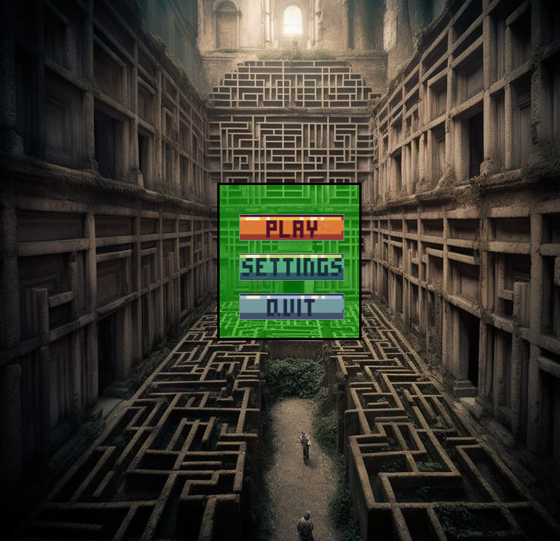
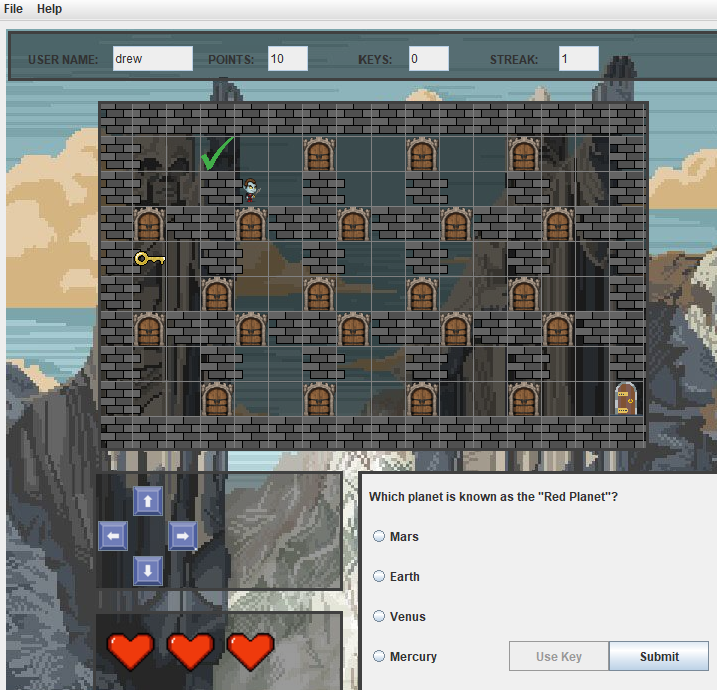

# 2D Trivia Maze Game
 

# Overview
Welcome to our 2D Trivia Maze Game! This game was developed as a group project by three computer science students. Navigate your character through a challenging maze filled with doors. To unlock a door, answer trivia questions stored in an SQLite database. Find the key hidden randomly in the maze, and make your way to the exit door to win the game. The game supports saving and loading, so you can pick up right where you left off.

# Features
Trivia-Based Doors: Each door in the maze requires answering a trivia question to unlock. The questions are stored in an SQLite database.
Random Key Location: The key to the exit door is placed randomly in the maze, adding an element of surprise and challenge.
Serialization: The game state can be saved and loaded, allowing you to continue your game at any time.
Java Swing GUI: The game features a graphical user interface built using Java Swing.

# How to Play
Start the Game: Run the game using the instructions above.
Navigate the Maze: Use the arrow keys to move your character through the maze.
Answer Trivia Questions: Approach a door and answer the trivia question to unlock it.
Find the Key: Locate the key randomly placed in the maze.
Exit the Maze: Navigate to the exit door once you have the key to win the game.
Save and Load: Use the save option to save your current game state and load it later to continue playing.
